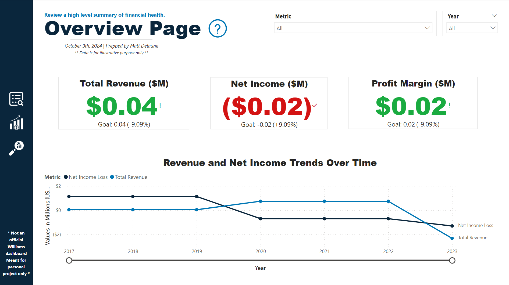
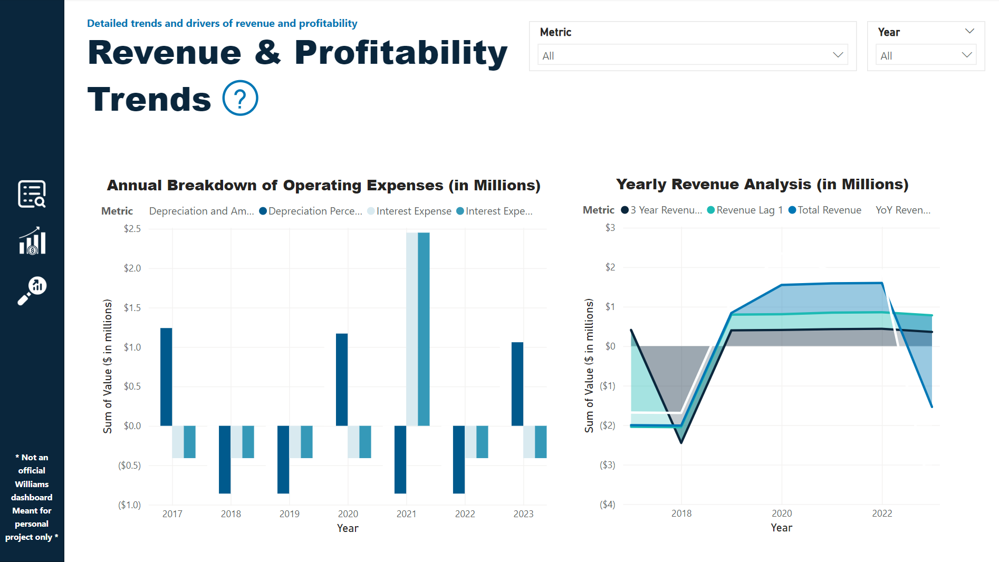
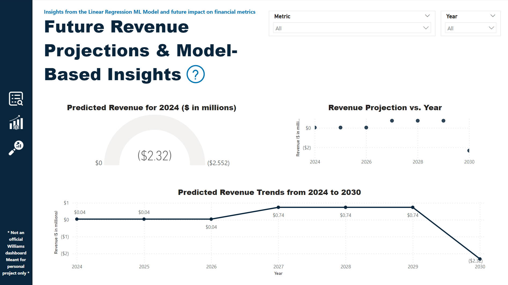

# Williams' Financial Data Insights & Revenue Forecast Dashboard

## Executive Summary

This project focuses on analyzing and projecting future revenue for Williams, Inc. using 10-K filings from 2013 onwards. The objective is to develop an informative Power BI dashboard that reports on key financial health metrics and presents predictions for future financial outcomes. The analysis includes exploration of historical financial data, feature engineering, and machine learning modeling to predict future revenues. The resulting insights and dashboard aim to provide a comprehensive view of financial performance while highlighting areas for optimization and growth.

Please note: This is not an official project by Williams, Inc.

The project serves as a proof of concept and emphasizes the potential for data-driven decision-making in financial analysis.

### Key Insights:

- **Data Cleaning and Standardization:** SEC 10-K filings required significant cleaning and feature engineering to create a reliable dataset for modeling.
- **Revenue Prediction:** Linear regression was employed for revenue forecasting. The predictions are displayed in a Power BI dashboard, offering insights into future revenue potential.
- **Key Metrics and KPIs Used:** Important financial KPIs such as net income, revenue growth rates, profit margins, and rolling averages were used to develop predictive features. These metrics were selected for their relevance in assessing financial health and understanding potential revenue drivers.
- **Comprehensive Dashboard:** Key financial metrics, historical trends, and model-predicted revenues are visualized in Power BI to help stakeholders make informed decisions.
- **Caveats:** Due to limitations in data availability and potential issues during data cleaning, results should be viewed as illustrative rather than definitive.

### Demonstrated Skills:

- **Data Processing & Feature Engineering**: Extensive data cleaning and feature generation from raw financial statements.
- **Machine Learning**: Linear regression modeling to predict revenue using engineered financial features.
- **Visualization**: Developing interactive Power BI dashboards to present both historical metrics and future predictions.
- **Critical Thinking & Problem Solving**: Adapting methods to work with limited datasets and addressing overfitting issues due to small sample sizes.

---

## Table of Contents

1. [Technologies Used](#technologies-used)
2. [Data Source](#data-source)
3. [Business Objective](#business-objective)
4. [Methodology](#methodology)
5. [Process](#process)
6. [KPIs and Metrics](#kpis-and-metrics)
7. [Insights and Recommendations](#insights-and-recommendations)
8. [Stakeholder Recommended Next Steps](#stakeholder-recommended-next-steps)
9. [Screenshots/Visual Examples](#screenshots-visual-examples)
10. [Conclusion](#conclusion)
11. [Contact](#contact)

---

## Technologies Used

- **Databricks**: Environment for data processing and machine learning.
- **Power BI**: Visualization and dashboard development.
- **Python (Version 3.9)**: Core programming language for data analysis, with the following libraries:
  - **Pandas**: Data cleaning and manipulation.
  - **NumPy**: Numerical operations and data manipulation.
  - **Scikit-Learn**: Machine learning model training and evaluation.
  - **Matplotlib**: Data visualization and plotting.

---

## Data Source

The dataset for this project comprises financial data extracted from 10-K filings of Williams, Inc. from 2012 to 20233. The data includes key metrics such as revenues, expenses, profit margins, and other financial indicators necessary for predicting future financial performance.

---

## Business Objective

**"How can we project future revenues of Williams, Inc. based on historical financial data from SEC 10-K filings, and provide a comprehensive dashboard to track current financial health and future performance?"**

The primary goal of this project is to analyze historical financial metrics and predict future revenues to facilitate better strategic decision-making for the company.

---

## Methodology

This project involves a step-by-step analysis process:

1. **Data Collection and Cleaning**: 10-K filings were collected, cleaned, and standardized.
2. **Exploratory Data Analysis (EDA)**: Key metrics were explored and insights into historical trends were derived.
3. **Feature Engineering**: Financial metrics were transformed to create features relevant for predictive modeling.
4. **Machine Learning Modeling**: Linear regression was used to predict future revenues.
5. **Dashboard Development**: Power BI was used to visualize historical financial data, future predictions, and other relevant insights for stakeholders.

---

## Process

### 1. Data and Libraries Import and Loading
- Imported necessary Python libraries, including Pandas, NumPy, and Matplotlib.
- Loaded the 10-K filings data and standardized the format for analysis.

### 2. Exploratory Data Analysis (EDA)
- Conducted initial exploration to understand the structure and trends in the financial data.
- Visualized key metrics such as revenue, profit margins, and expenses.

### 3. Feature Engineering
- Engineered features like year-over-year growth, rolling averages, and lag variables to enhance the predictive model's ability to capture trends.

### 4. Machine Learning Model Development
- Implemented a linear regression model to predict future revenues based on engineered features.
- Evaluated model performance using metrics like Mean Squared Error (MSE) and R-squared values.

### 5. Power BI Dashboard Creation
- Developed a dashboard with the following components:
  - **Overview Page**: Historical financial performance metrics.
  - **Revenue & Profitability Trends Page**: Trends in revenues, net income, and growth rates.
  - **Future Forecasts and ML Predictions Page**: Visualized predicted revenue figures using outputs from the ML model.

---

## KPIs and Metrics

### Key Metrics Used and Their Relevance

- **Total Revenues**: Represents the top line of the company's financial performance. Revenue growth was the primary target for prediction, indicating overall business success.
- **Net Income**: Essential for assessing the profitability of the company. Used as a feature to help understand the impact of cost efficiency on revenue.
- **Year-over-Year (YoY) Growth**: This metric helps understand how financial indicators are changing year-over-year. YoY growth was used as a feature to provide insight into financial trends and evaluate the company's growth trajectory.
- **Profit Margins**: Margins provide context for the company's operational efficiency and pricing strategies. We engineered features to capture these metrics and used them in the modeling process to predict future revenue.
- **Rolling Averages and Lag Variables**: These features were engineered to capture past trends and potential cyclical behavior, which is vital for making time-based predictions. Rolling averages help smooth out fluctuations, while lag variables capture dependencies between periods.

These metrics were chosen to comprehensively assess financial health, drive the predictive modeling process, and ensure the resulting predictions were well-aligned with key financial performance indicators.

---

## Insights and Recommendations

### Insights
- **Historical Revenue Growth**: The analysis indicated steady growth in revenues from 2013 to 2017, with fluctuations based on market conditions.
- **Future Revenue Predictions**: The ML model predicted future revenue, though the small dataset makes the model prone to overfitting.
- **Feature Importance**: Key features impacting revenue included depreciation expenses, net income, and revenue rolling averages.

### Recommendations
- **Enhanced Data Collection**: Obtain additional financial data to improve model reliability and reduce overfitting risks.
- **Automation of Data Pipeline**: Automate the process of collecting and cleaning 10-K filings for ongoing predictive analysis.
- **Caution in Interpretation**: The current analysis serves as a proof of concept, and results should not be used for critical business decisions due to data limitations and potential overfitting.

---

## Stakeholder Recommended Next Steps

### High Priority
- **Data Expansion**: Collect additional years of financial data to strengthen predictive modeling.
- **Refinement of Feature Engineering**: Focus on creating more robust features to improve model performance and generalizability.

### Medium Priority
- **Review of Model Predictions**: Validate predictions with additional business context to understand their reliability and refine where necessary.

### Low Priority
- **Exploration of Alternative ML Models**: Explore other machine learning models (e.g., Random Forest, LSTM) for improved accuracy and reliability.

---

## Screenshots/Visual Examples

Screenshots from the Power BI dashboard:

**Overview Page**

**Revenue & Profitability Trends Page**

**Future Projections Page**

---

## Conclusion

This project provides a comprehensive analysis of historical financial data from Williams, Inc., employing machine learning to project future revenues. While the insights and dashboard are useful for understanding financial trends, it is important to note that this project serves as a **proof of concept**. Due to limited data and potential data quality issues, the model is likely **overfitted**, and results should not be used for critical decision-making.

### Key Learnings:
- **Data Challenges**: The limited scope and availability of data posed significant challenges, leading to overfitting in the ML model.
- **Feature Engineering Matters**: Proper feature engineering played a vital role in achieving a high R-squared value for revenue predictions.
- **Proof of Concept**: This project successfully demonstrates the potential of machine learning for financial forecasting, but further work is needed to ensure practical applicability.

---

## Contact

For more information, please contact:

**Name**: Matt Delaune  
**Email**: [matt.delaune@gmail.com](mailto:matt.delaune@gmail.com)
